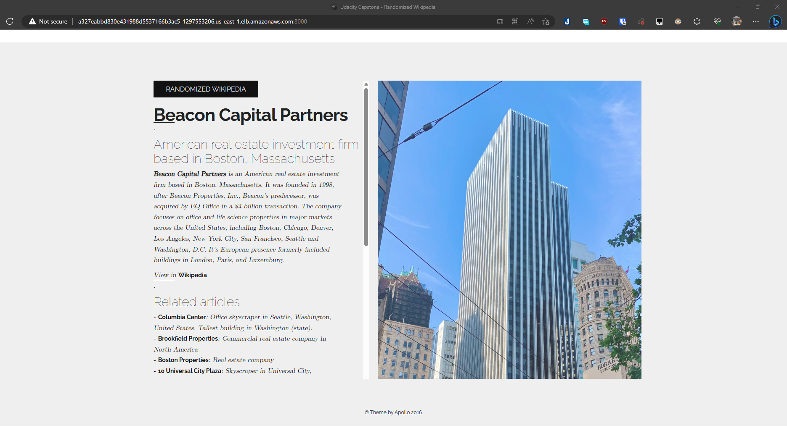

# Udacity Cloud DevOps Capstone

  

## Introduction

“Randomized Wikipedia” is a simple web page that provides users with a summary of a random article from Wikipedia. This page is designed to help users discover new articles on Wikipedia by providing them with a random article each time they hit the button. Simple and easy to use, and it’s perfect for anyone who wants to learn something new or explore the vast collection of articles on Wikipedia!

  

## Project Overview

This project is the result of "Cloud DevOps Nanodegree program". In this project you will find:

* A CloudFormation template to model and setup all necessary AWS resources. In this case is a complete and ready-to-use **Jenkins** master box with all needed tools.

* A infrastructure pipeline to creates **EKS cluster** in AWS.

* A deployment pipeline to deploy the application (**Docker** container) in **Kubernetes** cluster.

* Blue/Green deployment.  

## Project Structure
* `infrastructure`
	- `jenkins-server.yml`: CloudFormation template for creating Jenkins.
	- `jenkins-server-parameters.json`: Parameters for cloud formation stack above.
	- `Jenkinsfile`: Jenkinsfile for pipeline infrastructure.
* `kubernetes-resources`: Configuaration file for Kubernetes
* `screenshots`: All result images
* `scrip`: Scripts to create, delete and update CloudFormation stack.
* `src`: A static web code to deploy.
* `Dockerfile`
* `Jenkinsfile`: Jenkins file to define CICD step of this project.

   
## Setup the Environment
 
#### Overview

* EC2 instance with Ubuntu 20.04
* Docker
* Kubernetes and kubectl

#### Step to run
##### 1. Create Jenkin stack:

```$ sh scripts/create.sh jenkins-stack infrastructure/jenkins-server.yml infrastructure/jenkins-server-parameters.json```

This will create a Cloudformation stack with:
- VPC and Internet Gateway
- Subnet
- Routing Configuration
- Security Group (for Jenkins Server)
- Auto Scaling Group
- Launch Configuration

With Launch Configuration, our EC2 now comes with:
-   Jenkins
-   Docker
-   AWS CLI
-   eksctl CLI
-   kubectl CLI
-   Tidy

##### 2. Complete Jenkins configuaration via UI at `http://<EC2_PUBLIC_IP>:8080`
- Install plugins: 
	- [CloudBees AWS Credentials | Jenkins plugin](https://plugins.jenkins.io/aws-credentials/)
	- [Pipeline: AWS Steps | Jenkins plugin](https://plugins.jenkins.io/pipeline-aws/)
	- [Blue Ocean | Jenkins plugin](https://plugins.jenkins.io/blueocean/)
- Add new credentials: AWS credentials with ID `aws_credentials`
- Add new credentials: Username and password with your DokcerHub account, with ID `docker_account`

##### 3. From Jenkins dashboard, create new Pipeline named `pipeline-infra`
- This pipeline will creates a EKS cluster and configures kubectl
- Point to Jenkins script at `infrastructure/Jenkinsfile` of this repo
- This pipeline might take a little bit long to complete (about 10-20 mins)

##### 4. From Jenkins dashboard, create new Pipeline named `pipeline-deployment`
- Point to Jenkins script at `Jenkinsfile` of this repo
- Trigger the pipeline and wait for confirm step: Proceed/Abort. Accept it to the next step.

You can now visit the page at `http://a327eabbd830e431988d5537166b3ac5-1297553206.us-east-1.elb.amazonaws.com:8000/`



### Others
- Docker image can be found here: [thuyvyv2tv/udacity-capstone-cloud general | Docker Hub](https://hub.docker.com/repository/docker/thuyvyv2tv/udacity-capstone-cloud/general)
- Web template is based on: [Apollo Free Website Template | Free CSS Templates | Free CSS (free-css.com)](https://www.free-css.com/free-css-templates/page289/apollo)